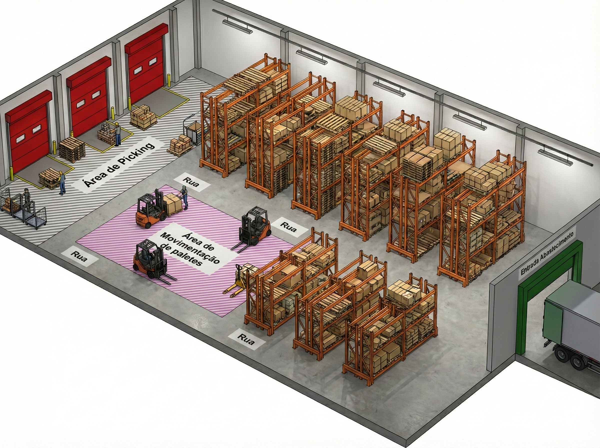

# 🏭 Advanced Warehouse Digital Twin - Cleaning Products Edition

## 📋 Sobre o Projeto

Este é um **Gêmeo Digital (Digital Twin)** de um armazém logístico especializado em **Produtos de Limpeza**, desenvolvido para simulação avançada e otimização operacional. A ferramenta permite modelar, visualizar e otimizar operações de intralogística, focando em estratégias de **Slotting (Alocação)**, **Roteirização** e **Dimensionamento de Frota de Empilhadeiras**.

O simulador foi calibrado para refletir a realidade de um Centro de Distribuição (CD) de bens de consumo (FMCG), com produtos reais como detergentes, sabão em pó e desinfetantes, respeitando suas dimensões físicas e restrições de paletização.


## 🚀 Funcionalidades Principais

### 1. 🧴 Inteligência de Produtos (Cleaning Products)


* **Dados Realistas:** O sistema gera SKUs baseados em categorias reais de limpeza (Detergente Líquido, Sabão em Pó, Amaciante, etc.).
* **Física do Produto:** Cada item possui peso (kg) e fator de paletização (`units_per_pallet`) realistas.
* **Lógica "Pallet In / Box Out":**
  * **Entrada:** O sistema simula o recebimento de paletes fechados para armazenagem.
  * **Saída:** O picking é feito em caixas (unidades de despacho), simulando a quebra do palete para montagem de cargas mistas.
  
### 2. 🎮 Como Funciona a Simulação (Estratégia)

Imagine o armazém como um tabuleiro vivo onde cada movimento custa tempo e dinheiro.

#### A. O Modelo "Hub-and-Spoke" (Picking)

A operação segue um fluxo de separação consolidada:

1. **O Pedido (Hub):** As missões partem da área de Staging (Expedição).
2. **A Busca (Spoke):** A empilhadeira se desloca até o endereço (Bin) para buscar a quantidade necessária de caixas.
3. **O Retorno:** Ela retorna ao Staging para depositar a carga e consolidar o pedido.

#### B. As Regras do Jogo (Física & Restrições)

O "robô" virtual obedece a leis físicas rigorosas:

* **Navegação Real:** Ele respeita os corredores e só cruza nas áreas permitidas (Cross Aisles).
* **Custo Vertical:** Pegar um produto no 5º nível (altura) custa significativamente mais tempo (elevação do garfo) do que no chão.
* **Zonas de Velocidade:** Áreas de alta densidade ou manuais podem ter restrições de velocidade.

#### C. Otimização Inteligente (Hill Climbing)

O módulo de **"Otimização Avançada"** utiliza um algoritmo de busca local (Hill Climbing) para reorganizar o armazém:

1. **Perturbação:** O algoritmo troca aleatoriamente a posição de produtos (ex: traz um item de alto giro do fundo para a frente).
2. **Simulação:** Ele re-simula um dia de operação com o novo layout.
3. **Avaliação:** Se o tempo total diminuiu, a mudança é mantida. Se aumentou, é descartada.
   *Resultado:* O armazém "aprende" a melhor configuração sozinho.

### 3. 📊 Visualização & Analytics

* **Gêmeo Digital 3D:** Visualização interativa de todo o armazém, mostrando onde cada categoria de produto está estocada.
* **Mapa de Calor de Tráfego:** Identifica visualmente os "pontos quentes" e congestionamentos nos corredores.
* **Rotas em 3D:** Traça o caminho exato percorrido pelas empilhadeiras para cumprir os pedidos.

### 4. 🏭 Dimensionamento de Frota

O sistema calcula a necessidade de equipamentos baseada na carga de trabalho real:

* **Cálculo de Horas:** (Total de Pedidos x Tempo Médio por Pedido) / Eficiência.
* **Capacidade:** Compara com as horas disponíveis da frota atual (Turno x Nº Empilhadeiras).
* **Alertas:** Indica dias críticos onde a operação entrará em colapso (Overload) sem horas extras ou mais máquinas.

## 🛠️ Como Executar

1. **Instale as dependências:**

   ```bash
   pip install pandas numpy plotly streamlit ortools
   ```
2. **Execute a aplicação:**

   ```bash
   streamlit run app.py
   ```
3. **No Navegador:**

   * Ajuste os parâmetros na barra lateral (Número de Pedidos, Empilhadeiras, etc.).
   * Clique em **"🔄 Gerar Novo Cenário de Dados"** para criar os produtos de limpeza.
   * Clique em **"🚀 Rodar Simulação"**.
   * Use a aba **"✨ Otimização Avançada"** para melhorar a performance.

## 📂 Estrutura do Projeto

* `app.py`: Aplicação principal (Dashboard Streamlit).
* `src/data_engine.py`: Geração de layout, produtos de limpeza e pedidos (Pallet In/Box Out).
* `src/slotting_engine.py`: Algoritmos de alocação e otimização (Hill Climbing).
* `src/simulation_engine.py`: Motor de simulação de rotas e cálculo de tempos.

---

**Desenvolvido para análise avançada de operações logísticas.**
